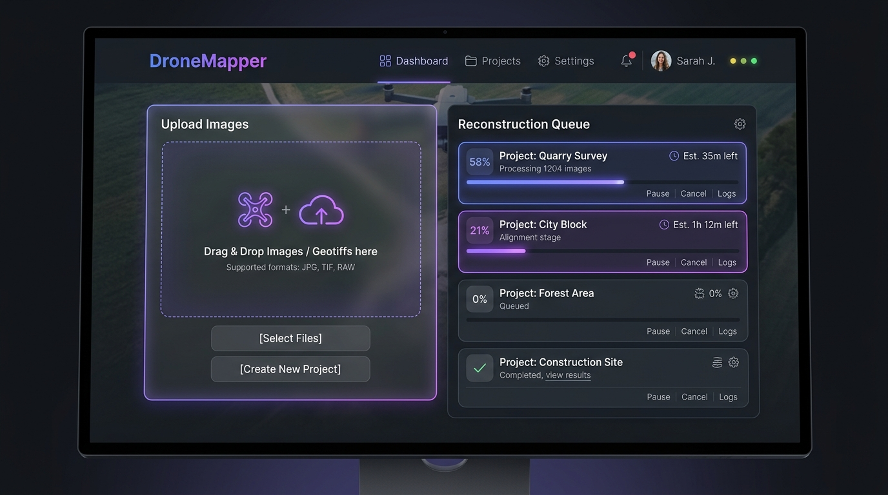
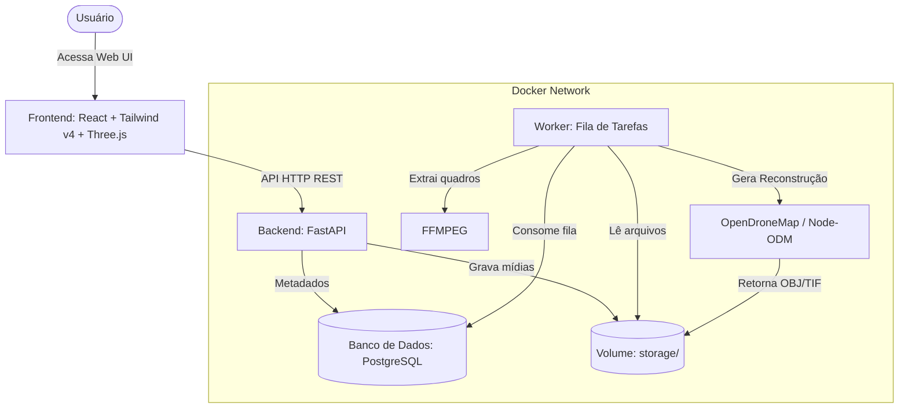

# DroneMapper 🛸

> Plataforma Self-Hosted de Reconstrução 3D e Fotogrametria para Drones.

DroneMapper é uma plataforma self-hosted completa para o gerenciamento e processamento de imagens aéreas capturadas por drones. O sistema permite criar projetos, realizar upload de fotos e vídeos, gerenciar uma fila de processamento assíncrona, extrair quadros de vídeos de forma automatizada usando FFMPEG, processar a reconstrução tridimensional com OpenDroneMap (ODM) e interagir com o modelo 3D resultante diretamente no navegador.



---

## 🛠️ Arquitetura do Sistema

O sistema é construído sobre uma arquitetura modular baseada em containers Docker, assegurando escalabilidade e facilidade de deploy local ou em servidores dedicados.



---

## ✨ Funcionalidades Principais

1. **Dashboard Premium**: Interface responsiva de alta fidelidade com tema escuro (dark mode), efeitos glassmorphism e micro-animações, desenvolvida com React 19, TypeScript e Tailwind CSS v4.
2. **Upload Inteligente**: Drag-and-drop de múltiplos arquivos simultaneamente (imagens JPEG/PNG e vídeos MP4/MOV) com monitoramento do progresso real através de XMLHttpRequest.
3. **Validação Rigorosa**: Validação no frontend e backend contra formatos de arquivos não suportados e limitação de tamanho (máximo de 2GB por arquivo).
4. **Extração de Quadros (FFMPEG)**: Caso um vídeo seja enviado, o Worker extrai automaticamente os quadros (1 frame por segundo) e os utiliza como fotos de entrada para a fotogrametria.
5. **Persistência PostgreSQL**: Todos os dados de projetos, contagem de mídias, status e progresso de processamento são persistidos utilizando SQLModel (SQLAlchemy 2.0).
6. **Fila de Tarefas Assíncrona**: Mecanismo de fila persistente no banco de dados que executa tarefas em segundo plano sem travar a API principal do sistema.
7. **Extração de Metadados EXIF**: Extração automática das coordenadas GPS (latitude e longitude) embutidas nos cabeçalhos das fotos aéreas durante o upload, gravando os metadados do projeto em `coordinates.json`.
8. **Integração OpenDroneMap (ODM)**: Integração via API HTTP com o container Node-ODM. O sistema conta com um **Modo Demo/Simulador integrado** que é executado por padrão se nenhum servidor ODM for configurado, permitindo testar e demonstrar toda a plataforma offline sem necessidade de infraestrutura pesada.
9. **Visualizador 3D Integrado**: Visualizador interativo 3D WebGL integrado utilizando Three.js (com OrbitControls e OBJLoader) para interagir com o modelo reconstruído (`.obj`) diretamente no navegador.

---

## 🚀 Como Executar o Projeto

Certifique-se de ter o [Docker](https://www.docker.com/) e o [Docker Compose](https://docs.docker.com/compose/) instalados em sua máquina.

### 1. Iniciar os Containers
Para compilar e iniciar todos os serviços (Banco de dados, API Backend, Worker e Web UI), execute o comando a partir do diretório raiz do projeto:
```bash
docker compose up --build -d
```

### 2. Acessar as Interfaces
* **Interface Web (Frontend)**: [http://localhost:8081](http://localhost:8081)
* **Documentação Swagger (Backend API)**: [http://localhost:8000/docs](http://localhost:8000/docs)
* **Status do Backend**: [http://localhost:8000/api/health](http://localhost:8000/api/health)

### 3. Configurar com OpenDroneMap Real (Opcional)
Por padrão, o Worker roda em modo de simulação gerando um modelo 3D mock (uma pirâmide). Para processar imagens reais usando o OpenDroneMap, adicione o serviço do Node-ODM ao seu `docker-compose.yml` ou aponte a variável de ambiente `ODM_URL` para o endereço do seu servidor Node-ODM:
```yaml
environment:
  - ODM_URL=http://seu-servidor-odm:3000
```

---

## 🧪 Como Executar os Testes

O projeto conta com uma cobertura completa de testes unitários e de integração no backend, utilizando pytest com um banco de dados SQLite em memória isolado (com `StaticPool`).

Para executar a suíte de testes dentro do container ativo do backend, rode:
```bash
docker compose exec backend python -m pytest
```

---

## 📁 Estrutura de Diretórios do Projeto

```text
DroneMapper/
├── backend/
│   ├── app/                 # Módulos da aplicação (API, models, schemas)
│   ├── tests/               # Testes unitários (pytest)
│   ├── Dockerfile           # Build do container Python (com ffmpeg)
│   ├── main.py              # Ponto de entrada FastAPI e rotas
│   ├── worker.py            # Fila de processamento assíncrona
│   └── requirements.txt     # Dependências Python
├── frontend/
│   ├── src/
│   │   ├── components/      # Componentes (Upload, Form, Viewer)
│   │   ├── App.tsx          # Dashboard principal
│   │   └── index.css        # Importação do Tailwind CSS v4
│   ├── Dockerfile           # Build multi-stage (Node.js -> Nginx)
│   ├── nginx.conf           # Configurações do Nginx para SPA
│   ├── package.json         # Dependências React e Three.js
│   └── vite.config.ts       # Configurações de build do Vite
├── docker-compose.yml       # Orquestrador de infraestrutura
└── README.md                # Este documento de referência
```
